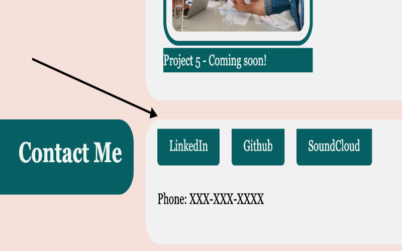

# <Portfolio>

## Description

- This landing page will be a useful tool for me, both now and in the future, in that I can direct future employers here to view my work. The goal was to use HTML and CSS to make this page striking, legible, clear, and easy to navigate. It is striking because it uses a global color palette and makes use of soft corners. It is legible because the font is large and legible. It is clear because the styling does not get in the way of the content. It is easy to navigate because of the nav bar and the large headings. 

This page will become an important platform for my future work, and it will be a testing area for new styles and ideas. 

Instead of being another applicant in the ocean of LinkedIn, this site will help me stand out, and I can direct future employers here directly. 

A simple website is often not so simple, especially if one wishes to maintain a consistent visual language. I have learned that it takes a lot of time to make a legible, usable, and attractive website. 

## Table of Contents

If your README is long, add a table of contents to make it easy for users to find what they need.

- [Usage](#usage)
- [Credits](#credits)
- [License](#license)
- [Tests](#tests)

## Usage

Click the nav bar to scroll!
Project names and contact information link to the particular project or site. 

## Credits

New and simplified CSS: 
https://picocss.com/docs/

Nav Bar:
https://www.codinglabweb.com/2021/03/navigation-bar-with-scroll-to-top.html

Color Palette: 
https://palettes.shecodes.io/

Most other CSS: 
https://developer.mozilla.org/en-US/docs/Web/CSS

## License

MIT License

Copyright (c) 2023 Andrew Nalley

Permission is hereby granted, free of charge, to any person obtaining a copy
of this software and associated documentation files (the "Software"), to deal
in the Software without restriction, including without limitation the rights
to use, copy, modify, merge, publish, distribute, sublicense, and/or sell
copies of the Software, and to permit persons to whom the Software is
furnished to do so, subject to the following conditions:

The above copyright notice and this permission notice shall be included in all
copies or substantial portions of the Software.

THE SOFTWARE IS PROVIDED "AS IS", WITHOUT WARRANTY OF ANY KIND, EXPRESS OR
IMPLIED, INCLUDING BUT NOT LIMITED TO THE WARRANTIES OF MERCHANTABILITY,
FITNESS FOR A PARTICULAR PURPOSE AND NONINFRINGEMENT. IN NO EVENT SHALL THE
AUTHORS OR COPYRIGHT HOLDERS BE LIABLE FOR ANY CLAIM, DAMAGES OR OTHER
LIABILITY, WHETHER IN AN ACTION OF CONTRACT, TORT OR OTHERWISE, ARISING FROM,
OUT OF OR IN CONNECTION WITH THE SOFTWARE OR THE USE OR OTHER DEALINGS IN THE
SOFTWARE.

---

## Features

Nav bar that smooth scrolls to selected area.
Live links.
Dynamic styling

## Tests

Click the nav bar to see the smooth scroll effect. 
